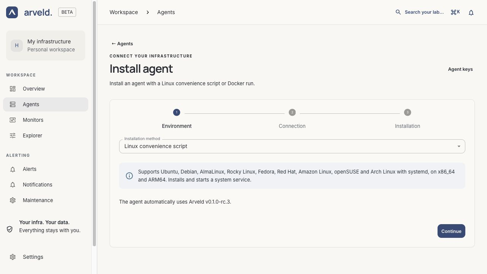

# Other installation methods

Start with the [Linux convenience script](installation.md) to install the latest
stable release. This guide covers exact versions, Docker, local builds and
manual execution. Use the same release version for the controller and Agents.

## Download release assets

Published Linux `amd64` and `arm64` candidates are listed in
[GitHub Releases](https://github.com/RSTCK-Innovation/arveld/releases). If no
release is listed, use the [source build instructions](../develop/setup.md).
Published assets and release images are public; no GitHub account or registry
login is required. Candidates are for evaluation; back up state before updates.
All commands below require an actually published version; replace the version
placeholder with its tag.

Download a specific version:

```sh
mkdir arveld-install && cd arveld-install
VERSION=YOUR_PUBLISHED_RELEASE_TAG
BASE="https://github.com/RSTCK-Innovation/arveld/releases/download/$VERSION"
for FILE in "arveld-${VERSION}_linux_amd64.tar.gz" \
  "arveld-agent-${VERSION}_linux_amd64.tar.gz" SHA256SUMS compose.yaml; do
  curl -fL "$BASE/$FILE" -o "$FILE"
done
sha256sum --check --ignore-missing SHA256SUMS
```

Use `arm64` in both archive names for an ARM64 host. Run the checksum command
inside the download directory. It must succeed for every downloaded file.
`SHA256SUMS` detects file corruption; authenticate the download source as well.
The GitHub release is immutable after publication.

For Docker, start the controller from the downloaded Compose file:

```sh
docker compose up --detach controller
```

The downloaded `compose.yaml` selects prebuilt images for that release, with no
source build. New releases use matching version tags for the controller and
Agent. The release's
`images.txt` retains the digests for verification.
Use the same setup, volumes and optional Agent profile described below. Keep
this installation directory and Compose project name for future updates.

For native execution, extract the archive you need and check the version:

```sh
tar -xzf "arveld-${VERSION}_linux_amd64.tar.gz"
./arveld --version
tar -xzf "arveld-agent-${VERSION}_linux_amd64.tar.gz"
./arveld-agent --version
```

Continue with the native controller and Agent instructions below. Runtime
dependencies are included in the binaries;
the controller downloads the pinned metrics and notification engines at first
start. Their checksums are recorded in `components.lock.json` on the release.

## Install a specific version

For a reproducible Linux service installation, download a versioned installer:

```sh
VERSION=YOUR_PUBLISHED_RELEASE_TAG
BASE="https://install.arveld.com/$VERSION"
curl -fL "$BASE/install-arveld.sh" -o install-arveld.sh
curl -fL "$BASE/SHA256SUMS" -o SHA256SUMS
sha256sum --check --ignore-missing SHA256SUMS
sudo sh install-arveld.sh
```

For an Agent, use `install-arveld-agent.sh` and supply `ARVELD_URL` and
`ARVELD_AGENT_TOKEN` as described in [Connect an Agent](agent-setup.md).
The versioned script always installs its embedded release, even after a newer
version is published.

To install from local release files, download the script, matching archive and
checksums into one directory, then pass that directory to the installer.
Replace `amd64` with `arm64` when needed:

```sh
BASE="https://github.com/RSTCK-Innovation/arveld/releases/download/$VERSION"
for FILE in install-arveld.sh "arveld-${VERSION}_linux_amd64.tar.gz" SHA256SUMS; do
  curl -fL "$BASE/$FILE" -o "$FILE"
done
sha256sum --check --ignore-missing SHA256SUMS
sudo env ARVELD_RELEASE_DIR="$PWD" sh install-arveld.sh
```

The system must still have the prerequisite packages. On first start, the
controller also needs network access to download its pinned managed engines.

## Start locally with Docker Compose

From the repository root, with Docker and Compose 2.23.1 or later installed:

```sh
docker compose up --build --detach
docker compose logs --follow controller
```

The first start downloads the pinned Prometheus and Alertmanager executables.
Wait until the controller and both engines are ready, then open
[localhost:8080](http://localhost:8080) and
[create the administrator](installation.md#create-the-administrator). To use another local port, run `ARVELD_HTTP_PORT=8081 docker compose up --detach`.

The supplied [Compose recipe](../../compose.yaml) publishes only
`127.0.0.1:8080`. It uses plain HTTP and disables secure-only cookies for this
local installation. For HTTPS behind a reverse proxy on the same host, start
with `ARVELD_SESSION_COOKIE_SECURE=true docker compose up --detach` and forward
all paths to the local port; see [HTTPS setup](https.md).

The controller runs as UID/GID `10001:10001`. Its named `arveld-data` volume holds
the database, metrics, notification state and downloaded engines under
`/var/lib/arveld`. Compose prefixes the volume name with the project name;
keep using the same project when recreating the service. The controller YAML
is supplied by `configs.controller-config.content` in `compose.yaml`.

Stop the installation with `docker compose down`; start it again with
`docker compose up --detach`. These commands preserve the data volume. Adding
`--volumes` to `down` deletes it and is not part of an update or normal shutdown.

After creating the administrator and an Agent key, you can activate the
[optional Agent service](#use-the-local-compose-installation)
in this same recipe. Use `--profile agent` when starting or stopping both
services together; the default commands above manage only the controller.

## Run a native controller

### Prepare the controller host

Choose a machine with persistent storage and a network address your Agents can
reach. The controller executable includes the web application; Go, Bun and a
source checkout are not needed on the machine running it.

On first start, Arveld downloads its pinned Prometheus and Alertmanager
executables. Allow outbound HTTPS to the official release locations listed in
[the component manifest](../../internal/components/components.lock.json).
Metrics are retained for 15 days by default; allow disk space for your chosen
[retention policy](controller.md).

The Docker image uses this same controller and embedded frontend. Its default
configuration listens inside the container on `0.0.0.0:8080`, stores data under
`/var/lib/arveld` and keeps secure cookies enabled. The local Compose recipe
explicitly overrides that last setting for HTTP.

The engines use fixed loopback ports `19090` and `19093`. Docker keeps these
inside the controller container; they are not published. For another native
controller on the same machine, use a separate VM or container network namespace;
changing only its HTTP port is insufficient.

### Start Arveld

Place the controller executable built for your operating system and architecture
in a writable installation directory. From that directory, run:

```sh
./arveld
```

On the first run, Arveld creates `data/` and `data/arveld.yml` with its default
configuration, then continues starting. You do not need to create the directory
or configuration file yourself. Later runs reuse the existing configuration.

The default listener is `127.0.0.1:8080`, and the database is `data/arveld.db`.
Paths are relative to the working directory, so keep starting Arveld from this
directory. Edit the generated configuration only when you need different
settings; see [controller configuration](controller.md).

Secure session cookies are enabled by default for [HTTPS deployments](https.md).
For a local plain-HTTP session, follow the [local HTTP note](controller.md#local-http-development)
before signing in.

After starting the controller, [create the administrator and check startup](installation.md#create-the-administrator).

## Use the local Compose installation

If you started the controller with the repository's [Compose recipe](#start-locally-with-docker-compose),
or a release Compose file, run these commands from the same directory and Compose project:

```sh
export ARVELD_AGENT_TOKEN='<complete agent key>'
docker compose --profile agent up --detach
docker compose logs --follow agent
```

For the source recipe, add `--build` on first startup. The release recipe pulls
its prebuilt images.

The optional `agent` profile starts an Agent alongside the controller. It uses
`http://controller:8080` on their shared Docker network, reads the key from your
environment and stores its identity in the project-prefixed `arveld-agent-data`
volume. The key is not written into `compose.yaml`. Supply it again whenever
Compose creates or recreates the Agent container; keep a protected copy outside
the checkout.

Stop both services with `docker compose --profile agent down`. To restart them,
restore the key in your environment and run
`docker compose --profile agent up --detach`. Keep the same project name and
both volumes; do not add `--volumes` to a normal shutdown. This Agent monitors
the Docker host (Docker's Linux VM on Docker Desktop).

For an Agent on another machine, use the Docker or native instructions below.

## Prepare an Agent installation

1. Open **Agents → Install agent**.
2. In **Environment**, choose **Linux convenience script** or **Docker run** as
   the **Installation method**, then select **Continue**. The Linux archive and
   Docker image always use the controller's release version; no version or
   image selection is needed. Automatic installation is unavailable when the
   controller reports a development or unknown version.
3. In **Connection**, enter the controller's reachable address in **Arveld URL**,
   such as `https://monitor.example.com`.
4. Select **Prepare installation**, then **Download installation script**.

[](../../website/public/product/agent-install.png)

*Product screenshot with example data. Select the image to enlarge it.*

The address must be reachable from the Agent's Linux host or container. In a container,
`127.0.0.1` refers to that container, not the controller host. Use the same HTTPS
address that your proxy forwards to Arveld; see [HTTPS setup](https.md).

### Install the prepared Linux service

The Linux option downloads a self-contained installation script with your
controller's version and the URL you entered. It does not contain your Agent key.
On the target Linux host, run:

```sh
export ARVELD_AGENT_TOKEN='<complete agent key>'
sudo --preserve-env=ARVELD_AGENT_TOKEN sh install-arveld-agent-linux.sh
```

The installer supports the same [Linux distributions and architectures](installation.md#install-on-linux-with-the-convenience-script)
as the controller script. It installs missing prerequisites, verifies the
release archive's checksum and version, then enables and starts
`arveld-agent.service` under the dedicated `arveld-agent` account. The executable
is `/usr/local/bin/arveld-agent`; identity and local configuration persist in
`/var/lib/arveld-agent`. Connection settings, including the key, are saved in
`/etc/arveld-agent/agent.env`, owned by root with mode `0600`.
The service grants `CAP_NET_RAW` for ICMP Monitors without running as root.

To use local release files, [download the Agent archive and `SHA256SUMS`](#download-release-assets).
Pass `ARVELD_RELEASE_DIR` when running the prepared installer:

```sh
sudo --preserve-env=ARVELD_AGENT_TOKEN \
  env ARVELD_RELEASE_DIR="$PWD" sh install-arveld-agent-linux.sh
```

Rerunning the release installer without connection variables preserves its
existing settings. Providing both variables replaces the saved connection.
In either case, the Agent identity is preserved. Back up state before upgrades.
Use `sudo systemctl status arveld-agent` and
`sudo journalctl -u arveld-agent -f` to inspect startup, then confirm the
connection and fresh measurements in Arveld.

## Run with Docker

The wizard prepares a script to run on the Agent host. It does not start a
container remotely. The public image tag matches the version of the Arveld
controller; no registry login is required.

Copy the downloaded script to the Agent host. In the terminal where you will run
it, provide the Agent key as instructed by the wizard:

```sh
export ARVELD_AGENT_TOKEN='<complete agent key>'
```

From the directory containing the downloaded file, run it with `sh`:

```sh
sh install-arveld-agent-docker.sh
```

The script uses the controller address you entered and its release version, and reads the key
from the terminal environment; the downloaded file does not contain the key.

The generated setup mounts a state volume at `/var/lib/arveld-agent` and the
host filesystem read-only at `/hostfs`. Preserve that state volume when replacing
the container. Use separate container names and state volumes if you adapt the
script to run several Agents on the same host.

## Run directly on Linux

Place the `arveld-agent` executable for your machine's architecture in a writable
installation directory. From that directory, provide the controller address and
the Agent key you created, then start it:

```sh
export ARVELD_URL='https://monitor.example.com'
export ARVELD_AGENT_TOKEN='<complete agent key>'
./arveld-agent
```

The executable contains both supervision and collection. It creates
`data/arveld-agent/` for its identity and local configuration. Keep starting it
from the same directory, or select a stable writable location with
`--storage-directory=/absolute/path`. No Docker mount or Supervisor YAML is
required. Ctrl+C or SIGTERM requests a graceful stop.

Native Linux collection measures the host filesystem and interfaces directly.
The account running the Agent needs access to the monitored resources; ICMP
permissions depend on the host's configuration.

After starting the Agent, [confirm the connection](agent-setup.md#confirm-the-connection).

## Container state and host collection

Keep the state volume mounted at `/var/lib/arveld-agent` when updating or
recreating the container. For native execution, preserve the directory selected
by `--storage-directory`, or `data/arveld-agent/` by default. Never run two Agents
from copies of the same identity. See [persistent data](persistent-data.md) and
[updates](updates.md).

On a Linux Docker host, CPU, memory, filesystem and uptime measurements describe
the host. On Docker Desktop, they describe Docker's Linux VM. Host uptime is the
kernel's running time, not the age of the container.

Network counters describe interfaces visible to the Agent's network namespace.
The host-root mount alone does not select host interfaces. On Linux, adding
`--network host` (or `network_mode: host` in Compose) allows host-interface
collection. This also changes connectivity for every Monitor assigned to that
Agent. Docker Desktop does not expose macOS physical interfaces through the
Linux host metrics scraper.

Monitors reflect the Agent's network environment. When a DNS result differs from
a lookup on another machine, compare it from the Agent's environment using the
[DNS troubleshooting guide](../reference/metrics.md#dns-results-that-differ-from-a-host-lookup).
