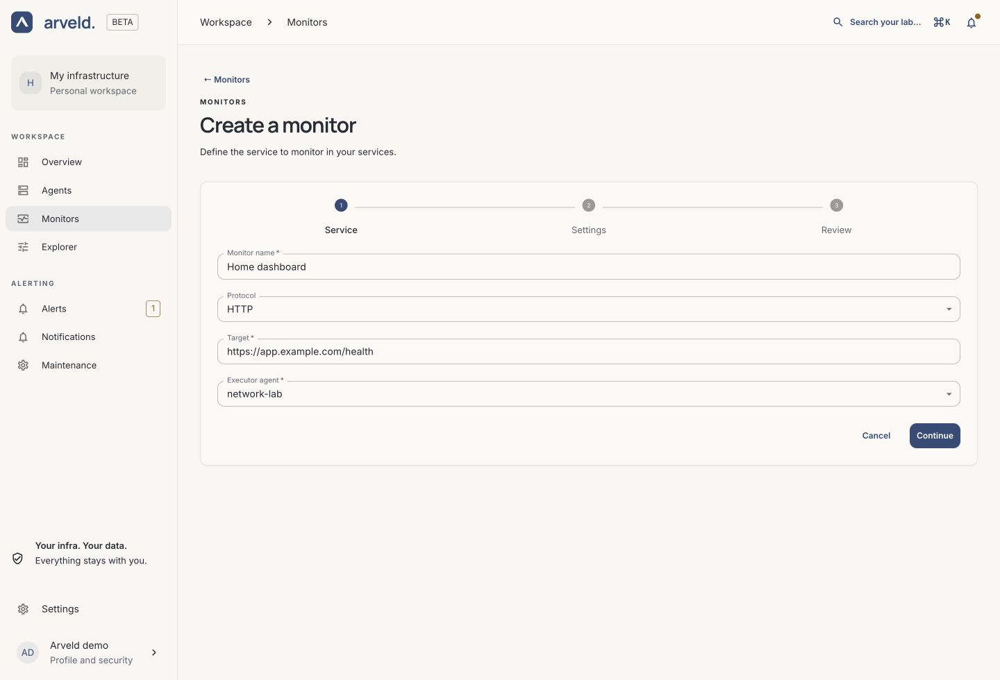
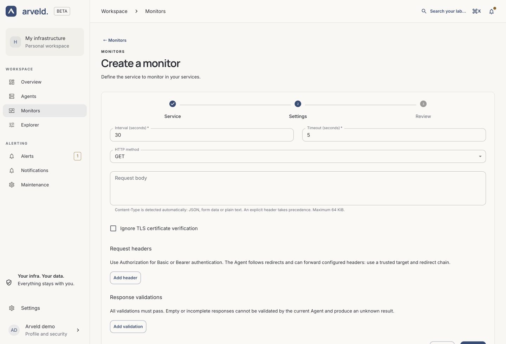
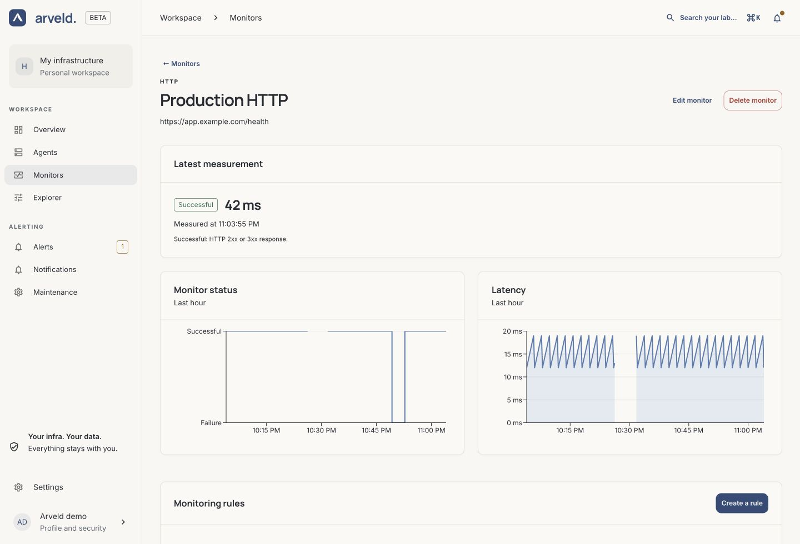

# Create your first Monitor

A Monitor checks a target from an Agent's network. Start with a
[connected Agent](agent-setup.md) that can reach the service you want to monitor.

## 1. Choose the service

Open **Monitors → Create a monitor**. In the **Service** step:

1. Enter a **Monitor name** you will recognize in the list and in alerts.
2. Choose the **Protocol**.
3. Enter the **Target**.
4. Select the **Executor agent**, then choose **Continue**.

| Protocol | Target example | What it checks |
| --- | --- | --- |
| HTTP | `https://app.example.com/health` | An HTTP or HTTPS response, with optional content validations |
| TCP | `database.internal:5432` | Whether a service accepts a connection |
| ICMP | `192.0.2.10` | Whether a host responds to ping |
| DNS | `example.com` | A DNS lookup through the resolver you select |

Use your own target in place of these examples. An offline Agent can be selected,
but it will receive the Monitor when it reconnects.

*Product screenshot with example data. Select a screenshot to view it at full size.*

## 2. Set the frequency and options

In **Settings**, choose **Interval (seconds)** and **Timeout (seconds)**. For an
HTTP health endpoint, 30 seconds between measurements and a 5-second timeout
are a useful starting point. Leave **HTTP method** on **GET** for a simple read.

Keep **Ignore TLS certificate verification** unchecked. Add request headers,
a body or response validations only when the service requires them. See
[Monitor settings](../reference/monitors.md#http-settings) for the other options.

For ICMP, set **Ping count**. For DNS, choose **DNS server**, **Record type** and
**DNS transport**. Select **Continue**.

*Product screenshot with example data.*

## 3. Review and save

In **Review**, check the target, Agent and timing. Use **Previous** to correct
anything, then select **Save monitor**. Arveld opens the Monitor's detail page.

Wait for the Agent to apply its configuration and perform a scheduled
measurement. Saving the form does not mean the first measurement has arrived.

## 4. Read the result

Read **Latest measurement** and the history charts. A missing or stale result
is not a confirmed service failure: first check that the Agent is connected and
its configuration is applied.

*Product screenshot with example data.*

The [results guide](../reference/metrics.md#monitor-results) explains statuses,
gaps and latency. Monitors run on their configured schedule; there is no
on-demand execution button.

## 5. Add a notification rule

On the same page, find **Monitoring rules → Create a rule**. Choose a condition,
duration, severity and notification channel. Follow
[notification setup](notifications.md) to check the complete delivery path.
