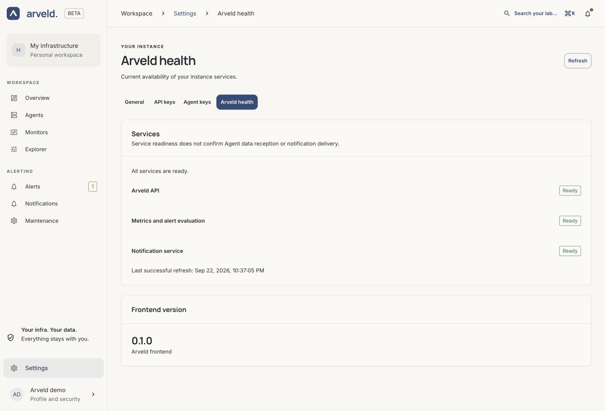

# Install Arveld

The controller serves Arveld's web application, stores its configuration and
runs the metrics and notification engines. Agents connect to it to run Monitors
and report host measurements.

The convenience script installs the latest stable release. Check
[GitHub Releases](https://github.com/RSTCK-Innovation/arveld/releases) for release
notes. The commands below become available with the first stable release.

## Install on Linux with the convenience script

Use a Linux host with systemd, persistent storage and a network address your
Agents can reach. The script supports `x86_64` and `aarch64` on Ubuntu, Debian,
AlmaLinux, Rocky Linux, Fedora, RHEL, CentOS Stream, Oracle Linux, Amazon Linux,
openSUSE/SLES and Arch Linux, including derivatives declaring one of these
families in `/etc/os-release`.

Download the latest stable installer, then run it with root privileges:

```sh
curl -fsSL https://install.arveld.com/install-arveld.sh -o install-arveld.sh
sudo sh install-arveld.sh
```

The installer detects your architecture, installs missing prerequisites and
verifies the release archive's checksum and binary version before installation.
Each downloaded script contains an exact release version; download it again to
install a newer stable release. Go, Bun and a source checkout are not needed.

The controller runs as the dedicated `arveld` account. Its executable is at
`/usr/local/bin/arveld`, configuration at `/etc/arveld/arveld.yml`, and persistent
data in `/var/lib/arveld`. The installer enables and starts `arveld.service`.
On first start, Arveld downloads its pinned Prometheus and Alertmanager engines;
allow outbound HTTPS and wait for startup to finish.

Inspect startup with:

```sh
sudo journalctl -u arveld -f
```

## Set up HTTPS

The controller listens on `127.0.0.1:8080` and uses secure session cookies by
default. Follow [HTTPS setup](https.md#forward-the-entire-origin) to expose your
Arveld address through a reverse proxy, then create the administrator.

## Create the administrator

Open your Arveld HTTPS address. Enter your name, email address and a password of 15–128
characters, then sign in. Arveld has one administrator
account. Complete this step before making the instance accessible to others.

The administrator manages Agents, Monitors, rules and notification channels.
Account and session details are in the [account and access guide](../reference/authentication.md).

## Check startup

1. Sign in and open **Settings → Arveld health**.
2. Select **Refresh**.
3. Check that all three services show **Ready** and the page reports
   **All services are ready.**

[](../../website/public/product/instance-health.png)

*Product screenshot with example data. Select the image to enlarge it.*

The first start can take longer while the managed engines download. If a service
remains unavailable, inspect the controller's terminal output or service logs.
This screen checks the controller and its engines; confirm Agent connectivity
and notification delivery separately through their guides.

## Next steps

[Connect an Agent](agent-setup.md), then [create your first Monitor](first-monitor.md).
For a lasting installation, choose stable [data locations](persistent-data.md)
and set up [backups](backup-restore.md).

## Keep the installation up to date

Read the new release's notes and [back up the complete state](backup-restore.md)
before updating. Download and run the script again to install the latest stable
release; existing configuration and data are preserved. Put custom service settings in
`systemctl edit arveld` so they survive reinstalls. See [updates](updates.md) for
verification and recovery.

For Docker, a specific version or manual execution, see
[other installation methods](advanced-installation.md).
