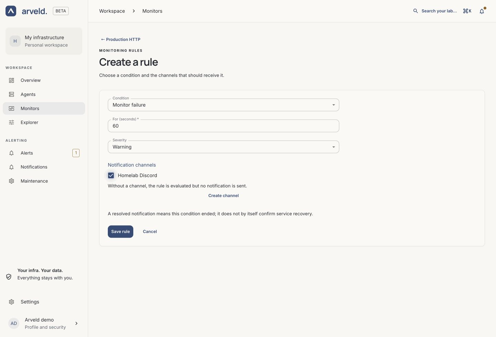

# Set up notifications

A notification channel defines **where** to send a message. An alert rule defines
**when** to send it. Create a channel, then assign it to a Monitor or Agent rule.

## Create a channel

1. Open **Notifications → Create channel**.
2. Enter a **Channel name** you will recognize when assigning it to a rule.
3. Choose the **Channel** type and complete its destination settings.
4. Select **Save channel**.

| Destination | Configuration to prepare |
| --- | --- |
| Email | SMTP connection, sender and recipient |
| Discord | Incoming webhook URL |
| Slack | Incoming webhook URL |
| Microsoft Teams | Teams Workflows webhook URL |
| Telegram | Bot token and chat ID |
| PagerDuty | Events API v2 integration/routing key |
| Webhook | Endpoint accepting Alertmanager's webhook payload |

*Product screenshot with example data.*

The [channel guide](../reference/notifications.md) covers provider-specific
fields, SMTP, grouping and timing. Saving validates and stores the configuration;
it does not send a test message or prove the provider accepts the credentials.

## Assign it to a rule

1. Open **Monitors**, select the service and find **Monitoring rules**. For a
   machine, open **Agents**, select it and choose **Alerts**.
2. Select **Create a rule** or edit an existing rule.
3. Choose the **Condition**, **For (seconds)** duration and **Severity**.
4. Under **Notification channels**, select the channel you just created.
5. Select **Save rule**.

*Product screenshot with example data. Select the image to enlarge it.*

A rule without an assigned channel can still be evaluated but has no notification
destination.

Monitor rules cover failures, missing measurements and latency. Agent resource
rules cover CPU, memory and disk thresholds. Conditions must remain true for
their configured duration before firing. Notification grouping and timing add
their own delays; delivery is not necessarily immediate.

## Check the full delivery path

Messages name the Monitor or Agent, explain the condition and show when it
started. Threshold alerts include the measured value and threshold, in
milliseconds or percent. A **Recovered** message means that the notified
condition is no longer active; other conditions on the resource may still need
attention. Notification timestamps use UTC.

Email includes a readable HTML layout and a plain-text version. Chat channels
and PagerDuty carry the same information. Open **Alerts** in Arveld to investigate.

Use a target you control and a destination intended for the exercise:

1. Open the Monitor. Confirm **Latest measurement** is successful and its rule
   in **Monitoring rules** is no longer **Waiting for publication**.
2. Make that target fail and wait through its interval, rule duration and
   notification grouping delay.
3. Check for **Firing** in **Monitoring rules**. Open **Alerts → View incident**
   to inspect the episode, and confirm the message at the destination.
4. Restore the target, confirm fresh successful measurements and check the
   recovery notification.

Arveld's instance readiness and a saved channel do not establish end-to-end
delivery. If no message arrives, check the rule state and channel assignment,
then review **Maintenance** and **Settings → Arveld health**.

## Silence planned maintenance

Open **Maintenance**, select the target and choose **Create silence**. Select
**Start now** or **Schedule for later**, fill in the timing and **Reason**, then
select **Create silence**. The [maintenance guide](../reference/notifications.md#schedule-maintenance)
shows the form and how to cancel a window.

A Monitor silence covers that Monitor; an Agent silence covers the Agent and
its Monitors.

Silences suppress notifications while monitoring and rule evaluation continue.
Incident acknowledgment records who is handling an incident; it does not resolve
the underlying condition or replace a silence.
