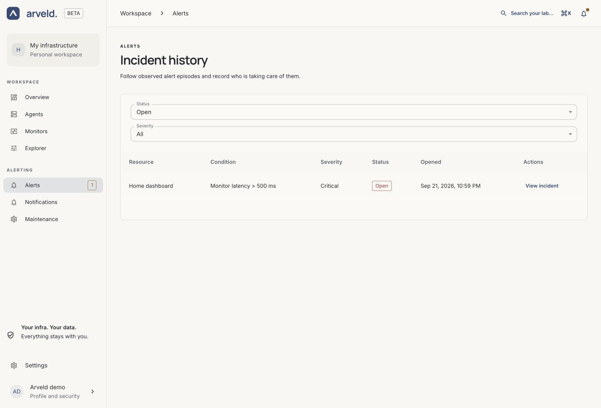

# Alert rules and incidents

A rule watches a condition on a Monitor or Agent. When that condition persists
for the configured duration, it can open an incident and notify the rule's
assigned channels.

## Create a rule

1. For a service, open **Monitors**, select it and find **Monitoring rules**.
   For a machine, open **Agents**, select it and choose **Alerts**.
2. Select **Create a rule**.
3. Choose a **Condition** and, where shown, a **Threshold**.
4. Set **For (seconds)**: how long the condition must persist before firing.
5. Choose **Severity** and select the **Notification channels** that should
   receive it.
6. Select **Save rule** and check its status in **Monitoring rules**.

*Product screenshot with example data. Select the image to enlarge it.*

| Resource | Condition | When it applies |
| --- | --- | --- |
| Monitor | **Monitor failure** | A recent measurement reports a known failure. |
| Monitor | **Missing measurements** | No recent usable result is available. |
| Monitor | **Monitor latency** | A recent latency measurement exceeds your threshold in milliseconds. |
| Agent | **CPU usage**, **Memory**, **Disk** | A fresh resource measurement exceeds your percentage threshold. |

A value exactly equal to a threshold does not exceed it. Missing measurements
do not count as a measured service failure or high resource usage. Use a
separate missing-measurements rule when you need to detect that condition.

A rule without selected channels still evaluates its condition but has no
notification destination. Use **Create channel** if the required destination
has not been configured yet.

## Read the rule status

Return to **Monitoring rules** on the resource:

| Status | Meaning |
| --- | --- |
| **Waiting for publication** | The saved rule has not yet been confirmed in the evaluation engine. |
| **No active alert** | The rule is not currently firing. |
| **Condition pending** | The condition is true, but its configured duration has not elapsed. |
| **Firing** | The condition has persisted long enough to trigger the rule. |
| **Evaluation unavailable** or **Unknown** | Arveld cannot establish a usable evaluation state. |

The rule duration and the channel's notification delays are separate. A firing
rule does not by itself prove that a message reached the destination.

## Edit or remove a rule

In **Monitoring rules**, select **Edit**, change the settings and choose
**Save rule**. Changes to the condition, duration or severity can restart its
pending period. To remove it, select **Delete** and confirm. Removing a rule
also removes its channel assignments; recorded incident history remains.

## Follow an incident

Open **Alerts**. Filter by **Status** and **Severity**, then choose
**View incident** on the episode you want to inspect. Use **Older incidents**
and **Newest incidents** to move through the history.

*Product screenshot with example data.*

The detail shows the condition, severity, opening time and timeline. **View
resource** opens the affected Agent or Monitor; **View rule** opens its current
rule when it still exists. The historical details remain available if the
original rule was removed.

Use **Acknowledge** to record that you are handling an open incident.
Acknowledgment does not resolve the condition and does not stop notifications.
A closed incident records why the episode ended; inspect fresh Monitor results
before concluding that the service recovered.

## Suspend notifications for maintenance

Use **Silence notifications** from the incident, or open **Maintenance**.
A silence suspends notifications while measurements and rule evaluation continue.
Follow the [silence guide](notifications.md#schedule-maintenance).
