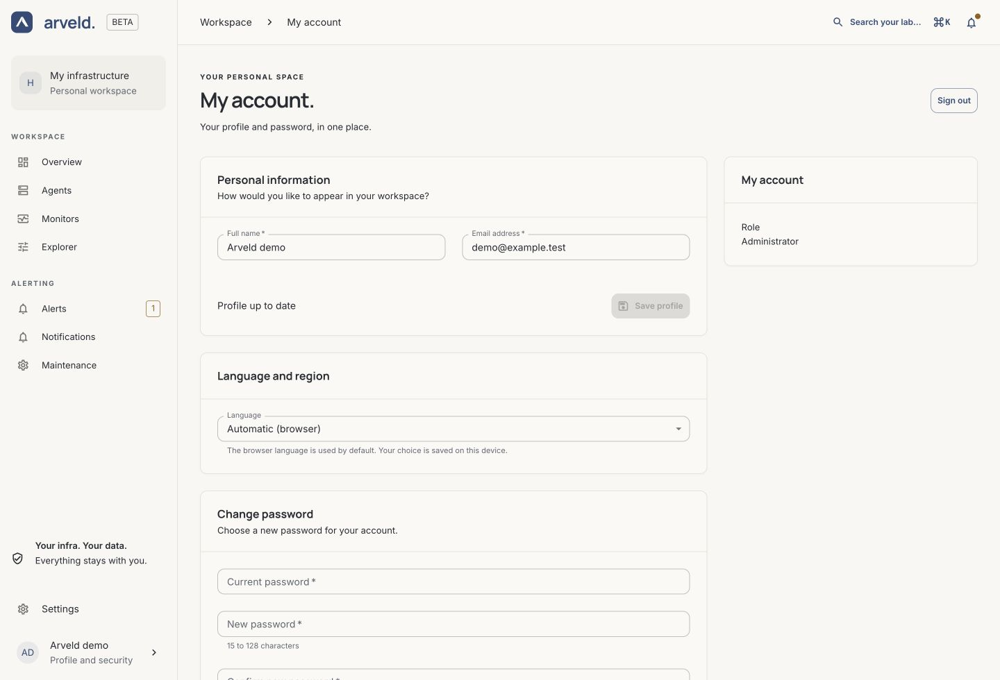

# Account and access

Arveld has one administrator account. Use it to manage the instance, its Agents,
Monitors and notification settings.

## Create the administrator and sign in

On a fresh installation, open Arveld in your browser. Enter your name, email
address and a password of 15–128 characters. After setup, sign in with that email
and password. See [installation](../guides/installation.md#create-the-administrator).

Complete initial setup before exposing the instance to other people. If a
session expires, sign in again. The login page does not send password-reset
emails. If you have lost access, the instance operator can
[reset the administrator password on the controller host](../guides/controller.md#reset-the-administrator-password).

## Update your profile

1. Select your account at the bottom of the navigation sidebar.
2. Under **Personal information**, edit **Full name** or **Email address**.
3. Select **Save profile**.

The **Profile up to date** message confirms there are no unsaved profile changes.
**Language and region** lets you choose the interface language; dates, times and
numbers follow that selection.

*Product screenshot with example data. Select the image to enlarge it.*

## Change your password or sign out

In **My account → Change password**, enter the current password, a new password
and its confirmation. Select **Change password**. A successful change signs out
all existing browser sessions; sign in again with the new password.

To leave the current browser session, select **Sign out** at the top of
**My account**.

## Connect Agents with Agent keys

Open **Settings → Agent keys → Create key**. Give the key a name that identifies
where it will be used, then create it and copy the complete value while it is
shown. Only its prefix is visible afterwards.

Use this key in the [Agent installation flow](../guides/agent-setup.md).
An Agent key connects Agents and authorizes their measurements; it does not
sign a person into the web application.

To retire a key, find it under **Agent keys**, select **Revoke** and confirm.
Agents using that key lose access. Prepare a replacement for those Agents before
revoking a key they still need.

## Manage integration keys

Open **Settings → API keys → Create key**. Give the key a recognizable name,
choose **Read only** or **Read and write**, and set the expiration shown in the
form. Copy the complete key when it is displayed and store it securely.

The list shows its prefix, permission, expiration and status. Select **Revoke**
to retire a key. API call examples will be documented separately in the future
OpenAPI reference.
