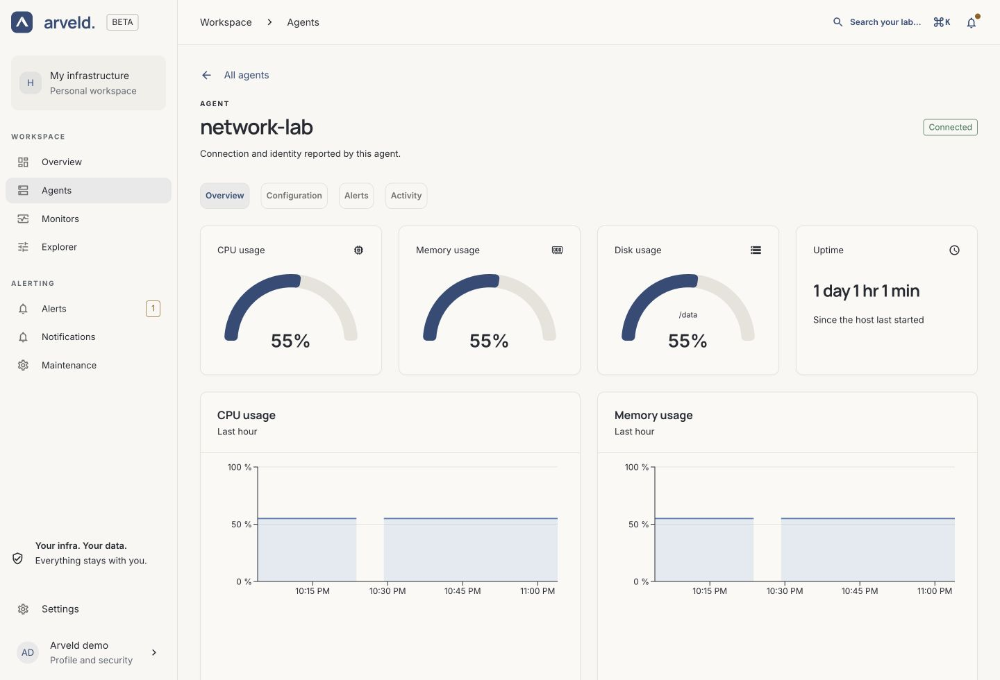
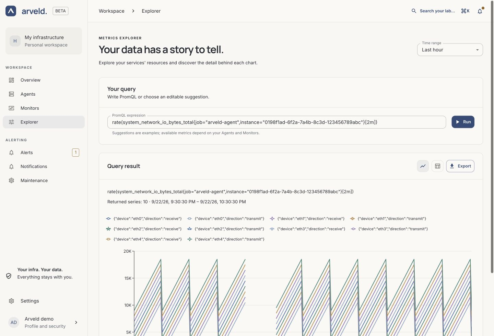

# Read results and metrics

Start from a Monitor or Agent to understand a service's state. Use **Explorer**
when you want to inspect a particular metric or export its values.

## Monitor results

1. Open **Monitors** and select the service.
2. Read **Latest measurement** for its current status and latency.
3. Inspect the history charts to see when failures, changes in latency or
   missing measurements occurred.

*Product screenshot with example data. Select the image to enlarge it.*

| Result | How to interpret it |
| --- | --- |
| Successful measurement | The protocol's success condition was met. |
| Failed measurement | The Agent reported a known failure, such as a refused connection or failed response validation. |
| Missing or unknown result | Arveld has no recent usable measurement. Check the Agent before concluding the target is down. |

For HTTP, success needs a 2xx/3xx response and any configured validations to pass.
For TCP, the connection must succeed. ICMP success requires no packet loss.
For DNS, `NOERROR` is successful; an expected address or answer record is not
validated automatically.

The list's bars summarize the last hour. Red includes a measured failure, gray
indicates missing coverage, and green indicates observed success. The displayed
availability percentage excludes unknown periods; it is not an SLA report.
Charts preserve gaps where no usable measurement is available.

### Investigate an HTTP result

On the Monitor's detail page, read its HTTP diagnostic measurements and saved
**Configuration**. Check the method, headers and response validations against
what the target expects. A validation failure can make an HTTP 200 response
unsuccessful. An empty or incomplete response may not provide enough data to
evaluate the configured validations.

### DNS results that differ from a host lookup

Open the DNS Monitor and check **DNS server**, **Record type**, **DNS transport**
and **Executor agent** under Configuration. The Monitor uses that Agent's network;
a lookup on your laptop may follow a different resolver or network path.

If you change the resolver or transport through **Edit monitor**, save it and
wait for a new measurement before comparing results. Docker and VPN networking
can affect the path taken by the Agent.

## Host metrics

Open **Agents** and select a machine. Its **Overview** shows CPU, memory, disk,
network and uptime measurements, with history where available.

*Product screenshot with example data.*

If a metric is unavailable, check whether the Agent is connected, then inspect
its **Configuration** tab. Wait for fresh samples after installation or restart.
A disconnected Agent can leave historical measurements without a current value.

On Docker Desktop, host measurements describe its Linux VM. On a Linux Docker
host, they describe the host machine. Uptime is the kernel's running time, so it
does not reset just because the Agent container was recreated.

### Network traffic

The Agent's network chart separates received and sent traffic by interface.
Rates use units such as B/s or kB/s. A new Agent needs more than one sample to
produce a rate; an initial gap is expected.

The visible interfaces depend on the Agent's network configuration. A bridge
container reports its container network, and Docker Desktop does not expose
macOS physical interfaces through this Linux Agent. See
[Agent host collection](../guides/agent-setup.md#state-and-host-collection).

## Metrics Explorer

1. Open **Explorer** from the sidebar.
2. Select a time range.
3. In **PromQL expression**, type a metric name or choose an editable suggestion,
   such as **Network bytes per second**.
4. Select **Run**.
5. Use **Chart view** or **Table view** to inspect the returned series. Use
   **Export** to save a CSV of the displayed query's full result.

*Product screenshot with example data.*

Suggestions are starting points, not a list of every metric in your instance.
You can edit the expression before running it. After changing the expression or
time range, select **Run** again; **Changes to run** identifies unsent changes.

Each series keeps its labels so you can distinguish Agents, Monitors and
interfaces. Missing values remain gaps, while a measured zero remains zero.
If no series are returned, check the selected period and whether the relevant
Agent or Monitor has sent measurements.

## Read active retention

Open **Settings → General → Metrics retention**. The panel shows the policy
currently applied to stored metrics. Select **Refresh** to read it again.

Retention is read-only in the interface. The instance operator changes it in the
[controller configuration](../guides/controller.md), then restarts Arveld. The
**Browser preferences** form on the same page changes only that browser's
workspace name and interface refresh preference.
