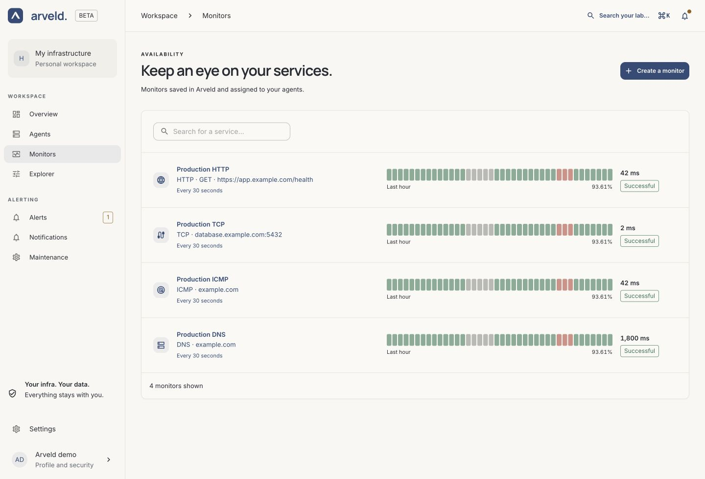

# Manage Monitors

Use **Monitors** to browse the services checked by your Agents. For a new
Monitor, follow the [three-step creation guide](../guides/first-monitor.md).

## Find a Monitor

Open **Monitors** and use **Search for a service…** to find a target. Select its
name to open the latest measurement, history, rules and configuration.

*Product screenshot with example data. Select the image to enlarge it.*

The recent-history bars show successes, failures and missing measurements.
Missing data is shown separately from a measured failure. See
[reading results](metrics.md#monitor-results).

## Edit a Monitor

1. Open **Monitors** and select the Monitor.
2. Select **Edit monitor**.
3. Update the **Service** and **Settings** steps.
4. Check **Review**, then select **Save monitor**.

The existing values are filled in. You can change the name, target, Agent and
settings, but the protocol remains fixed. To switch protocols, create another
Monitor. **Cancel** discards the unsaved form; a save error keeps your entered
values available for correction.

## HTTP settings

In the wizard's **Settings** step, configure only what your target needs:

| Control | How to use it |
| --- | --- |
| **HTTP method** | Leave GET for a simple page or health endpoint; choose another method when required by the target. |
| **Request body** | Enter the payload required by that target. Leave it empty for a normal GET. |
| **Ignore TLS certificate verification** | Leave unchecked to verify the HTTPS certificate. |
| **Request headers → Add header** | Add a header name and value, such as the credentials required by a private health endpoint. |
| **Response validations → Add validation** | Check response text, a regular expression, a JSON path or body size. |

*Product screenshot with example data.*

All configured response validations must pass. A successful HTTP status alone
is insufficient when a validation fails. Empty or incomplete bodies can produce
an unknown validation result. Use trusted targets and redirect chains when
sending credentials; the Agent can forward configured headers on redirects.

## TCP, ICMP and DNS settings

For **TCP**, enter a hostname and port in **Target**. This checks whether a
connection can be established; it does not validate a database login or perform
a TLS check.

For **ICMP**, enter the host in **Target** and choose **Ping count** in Settings.
Packets are spaced one second apart, and the count must fit within the timeout.

For **DNS**, enter the domain in **Target**, then select a resolver in **DNS
server**, a **Record type** and a **DNS transport**. A successful result means the
resolver returned `NOERROR`; it does not require an answer record or compare the
answer with an expected IP address.

For every protocol, **Interval (seconds)** controls frequency and **Timeout
(seconds)** limits each measurement. The form allows intervals of 10–3600
seconds and timeouts of 1–60 seconds, no longer than the interval.

## Move a Monitor to another Agent

Open **Edit monitor** and change **Executor agent** in the Service step. Save,
then check the new Agent and wait for fresh results on the Monitor's detail page.

Choose an Agent that can reach the target. If the old Agent is offline, it can
continue its previous configuration until it reconnects. Reassignment is not an
instant handoff between machines.

## Delete a Monitor

Open its detail page, select **Delete monitor**, check the name in the
confirmation and confirm. Arveld returns to the Monitors list.

Deletion removes the Monitor and its rules. Its Agent stops running it after
receiving the configuration change. Existing measurements remain until they
expire under the instance's retention policy. The deleted Monitor no longer has
a detail page.
