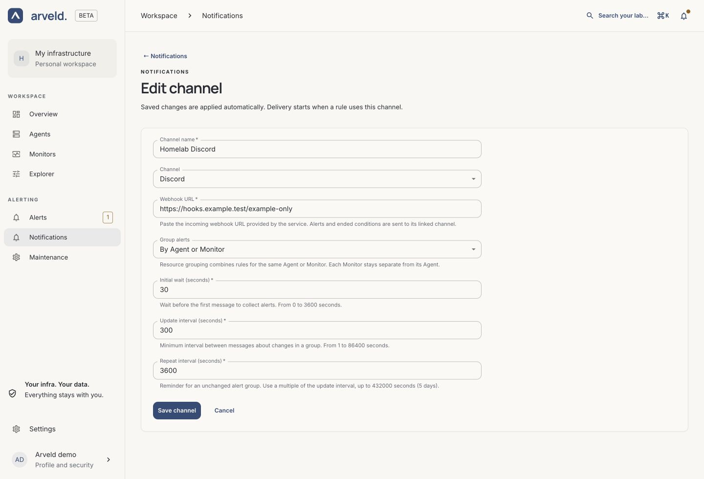
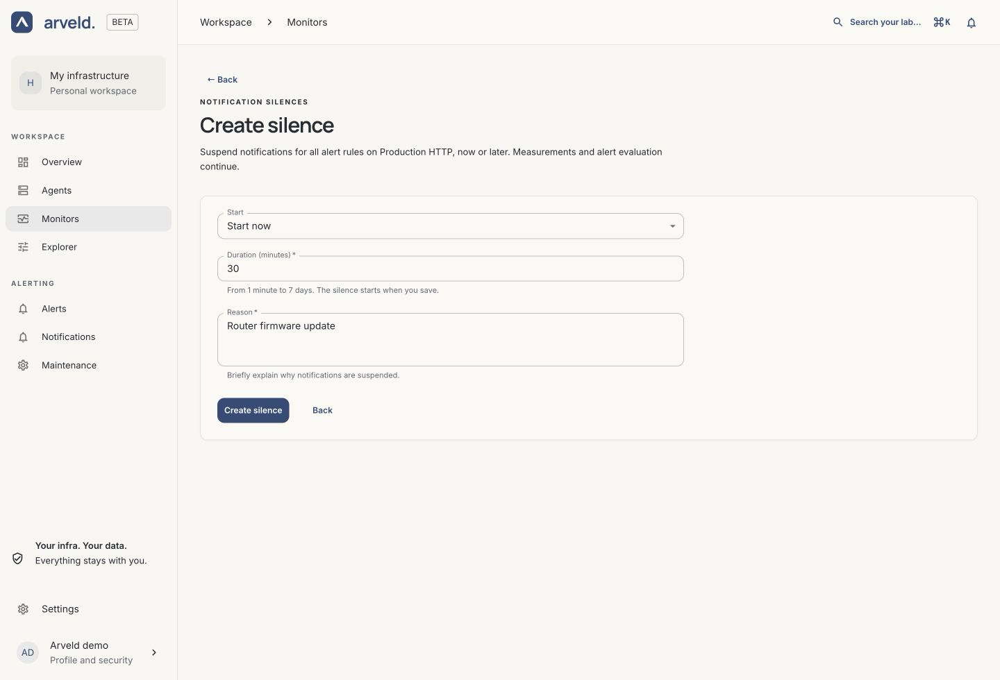

# Channels and maintenance

Use **Notifications** to choose where alerts are sent, and **Maintenance** to
suspend messages temporarily. A channel receives alerts only after you assign it
to a rule on a Monitor or Agent.

## Create or edit a channel

1. Open **Notifications → Create channel**.
2. Enter a **Channel name** you will recognize when assigning it to a rule.
3. Select the **Channel** type and complete its fields.
4. Review the grouping and timing settings, then select **Save channel**.

To update a channel, open it from **Notifications**, change the fields and select
**Save channel** again. When changing its type, fill in the new type's settings.

*Product screenshot with example data. Select the image to enlarge it.*

## Choose the destination

| Channel | Fields to complete in Arveld |
| --- | --- |
| **Webhook** | **Webhook URL** for a destination that accepts Alertmanager notifications. |
| **Discord** | **Webhook URL** supplied by the destination's incoming webhook. |
| **Slack** | **Webhook URL** for the channel's incoming webhook. |
| **Microsoft Teams** | **Webhook URL** from a Teams Workflow accepting an incoming webhook. |
| **Telegram** | **Telegram bot token**, **Chat ID**, and optionally **Topic ID**. |
| **PagerDuty** | **PagerDuty routing key** and the appropriate Events destination URL. |
| **Email** | SMTP server, connection security, sender, recipient and any SMTP credentials. |

The destination credentials come from your provider. Saving a channel stores its
settings; it does not send a test message or confirm those credentials work.

### Email

Choose **Email**. Enter a **SMTP server** with its port, for example
`smtp.example.com:587`, then select the matching **Connection security** mode:

- **STARTTLS (required)** upgrades the connection to TLS.
- **Implicit TLS** uses TLS from the start of the connection.
- **Unencrypted relay (no authentication)** is for a relay that does not require
  credentials; the form disables username and password in this mode.

The port does not automatically select the security mode. Enter **Sender email**
and **Recipient email** as individual addresses. One channel has one recipient;
use a mailing-list address or separate channels to reach several recipients.
If the server requires authentication, complete both **SMTP username** and
**SMTP password**.

### Telegram

Enter the bot token and the numeric **Chat ID**, keeping a leading minus sign
when present. Make sure the bot can send messages to that chat. For a forum topic,
fill in **Topic ID (optional)**; leave it empty for a message without a topic.
Keep **Telegram API URL** at its default unless you operate your own server.

### Microsoft Teams and PagerDuty

For Teams, use a **Workflows** incoming webhook. The older Office 365 connector
format is not supported. The Workflow must accept webhook requests without
additional tenant credentials, since Arveld's form only asks for its URL.

For PagerDuty, enter the integration's **PagerDuty routing key**. Keep the
default **PagerDuty Events API URL** unless your service's region requires a
different destination.

## Group alerts and control reminders

In the channel editor:

| Control | Effect |
| --- | --- |
| **Group alerts → By rule** | Keeps each rule's notifications separate. |
| **Group alerts → By Agent or Monitor** | Combines conditions for the same resource. An Agent's rules remain separate from those of its Monitors. |
| **Initial wait (seconds)** | Wait before the first notification for a group. |
| **Update interval (seconds)** | Interval for sending changes to a notified group. |
| **Repeat interval (seconds)** | Reminder interval while a group remains firing without changes. |

The initial defaults are 5 seconds, 30 seconds and 14,400 seconds respectively.
The repeat interval must be a multiple of the update interval. A rule's own
**For (seconds)** duration applies before these delivery timers.

## Assign the channel and check delivery

Open a Monitor's **Monitoring rules**, or an Agent's **Alerts** tab. Create or
edit a rule, select the channel under **Notification channels**, then choose
**Save rule**.

Follow the [delivery walkthrough](../guides/notifications.md#check-the-full-delivery-path)
with a target and destination you control. Confirm both the failure message and
the notification after the condition ends. If nothing arrives, check the rule
status, selected channels, maintenance windows and **Settings → Arveld health**.

To remove a channel, first deselect it from every rule using it and save those
rules. Then delete it from **Notifications** and confirm. Arveld prevents removal
while a rule still uses the channel.

## Schedule maintenance

1. Open **Maintenance**, choose a **Target** type and select the Monitor or Agent.
2. Select **Create silence**.
3. Choose **Start now** and a **Duration (minutes)**, or **Schedule for later**
   and fill in the start and end times.
4. Enter a **Reason**, then select **Create silence**.

*Product screenshot with example data.*

Times use your browser's time zone. Windows can last from one minute to seven
days. A Monitor silence covers that Monitor; an Agent silence covers the Agent
and its Monitors. Measurements, rules and incident history continue during the
window.

## Review or cancel a silence

In **Maintenance**, review the target, reason, author, dates and state:
**Pending**, **Active** or **Expired**. To finish an active or scheduled window
early, select **Cancel silence**, review the affected resource and confirm.
Notifications become eligible again; delivery still follows the channel's timers.

You can also use **Notification silences → Create silence** on a Monitor's detail
page or an Agent's **Alerts** tab. Use **Maintenance** when checking whether an
Agent-level window also covers one of its Monitors.
